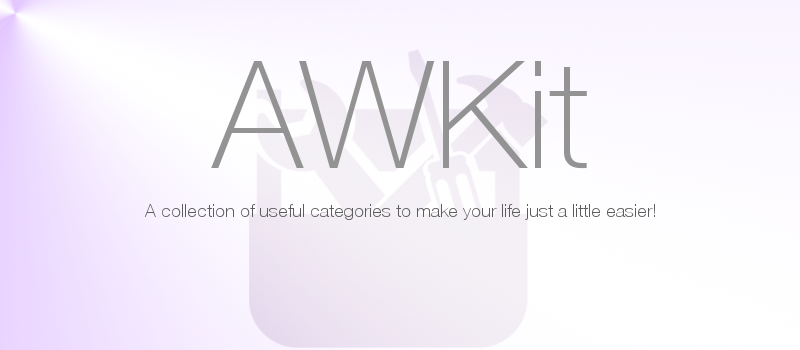

# AWKit

## Contents

Contains the following classes and categories:
*  AWKitMath - Has shorthands for handling 32- and 64-bit differences on floats
*  UIActionSheet+AWKit - Provides support for UIActionSheets with additional onDismiss and onCancel block callbacks
*  UIImage+AWKit - Contains functions that calculate image size based upon some constraints like size and containers
*  NSBundle+AWKit - NSBundle shorthands to get current version and so on
*  UIAlertView+AWKit - Provides support for UIAlertView with additional onDismiss and onCancel block callbacks
*  UIScreen+AWKit - Contains functions that return current screen bound for current rotation
*  NSObject+AWKit - Contains shorthands to execute a block on threads
*  UIColor+AWKit - Contains functions for hex to UIColor and more..
*  NSString+AWKit - Contains functions to strip strings from characters and lots more...
*  UIDevice+AWKit - Contains functions that determine current device and more 

This kit is a work in progress and will add more functionality as development continues!

## Usage

For a complete set of methods, see the documetation at [leetal.github.io/AWKit/documentation/](http://leetal.github.io/AWKit/documentation/).

## Requirements

iOS6+ is required.

## Installation

Make sure to include the headers you want. AWKit.h is the most common and will provide you with all the categories.

### CocoaPods
AWKit is available through [CocoaPods](http://cocoapods.org). To install
it, simply add the following line to your Podfile:

    pod "AWKit"

### Manual
Clone the repository and drag the files into your project.

## Author

Alexander Widerberg, widerbergaren@gmail.com

## License

AWKit is available under the MIT license. See the LICENSE file for more info.

